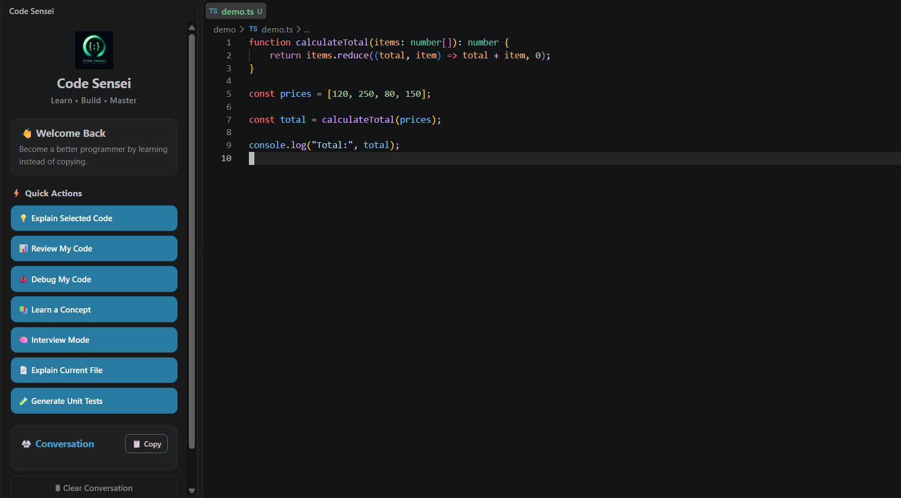

# 🥋 Code Sensei

> **Learn. Build. Master.**

Code Sensei is an AI-powered coding mentor for VS Code designed to help developers **understand code instead of simply copying solutions**.

It brings AI-powered explanations, debugging guidance, code review, unit-test generation, file analysis, and interview practice directly into the VS Code workflow.

---

## ✨ Features

| Feature | What it does |
|---|---|
| 💡 **Explain Selected Code** | Breaks selected code down step-by-step |
| 📊 **Review My Code** | Analyzes code and suggests improvements |
| 🐞 **Debug My Code** | Identifies problems and explains how to fix them |
| 📚 **Learn a Concept** | Helps understand programming concepts |
| 🧠 **Interview Mode** | Generates interview questions from your code |
| 📄 **Explain Current File** | Understands and explains the complete file |
| 🧪 **Generate Unit Tests** | Creates test strategies and test cases |

---

# 🚀 Code Sensei in Action

## 1. Code Sensei Overview

The Code Sensei sidebar brings your AI coding mentor directly into VS Code.



---

## 2. Explain Selected Code

Select a piece of code and let Sensei break it down step-by-step.


---

## 3. Debug My Code

Code Sensei can analyze problematic code, identify the issue, and explain the reasoning behind the fix.


---

## 4. Generate Unit Tests

Generate test strategies and test cases for your selected code.


---

## 5. Explain Current File

Understand the purpose and structure of an entire source file without leaving VS Code.


---

## 6. Interview Mode

Turn your own code into an interview practice session.


---

# 🧠 Why Code Sensei?

Most AI coding tools focus on giving you the answer.

Code Sensei focuses on helping you **understand why**.

### The philosophy

```text
Question
   ↓
Understand
   ↓
Think
   ↓
Learn
   ↓
Build