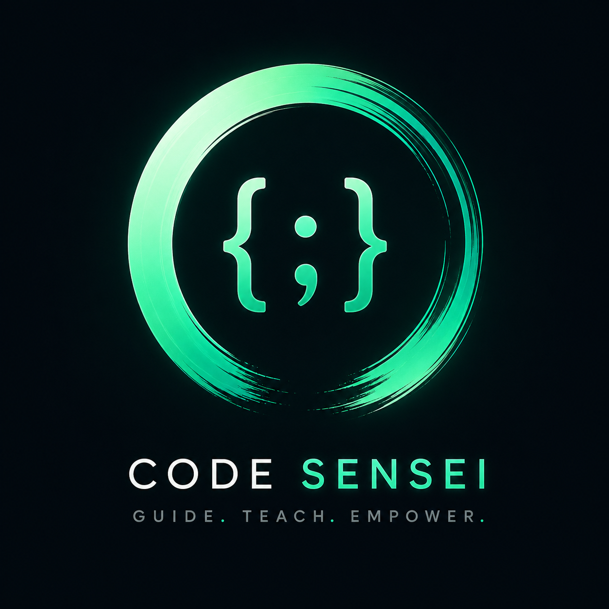
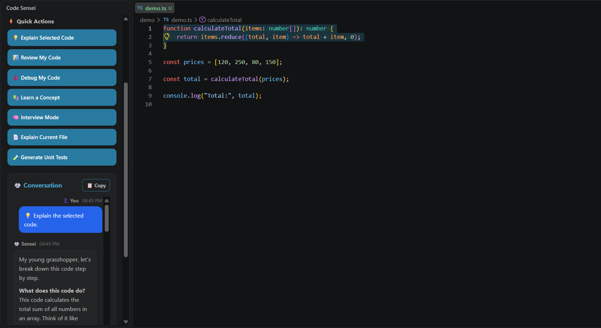
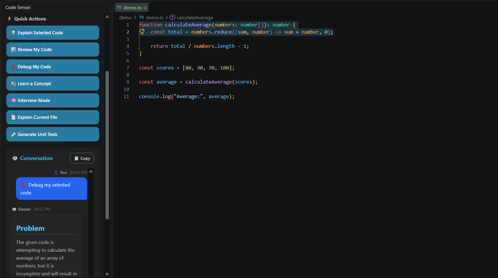
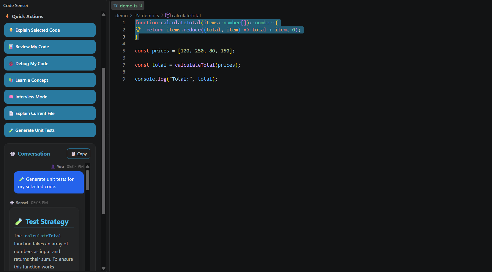
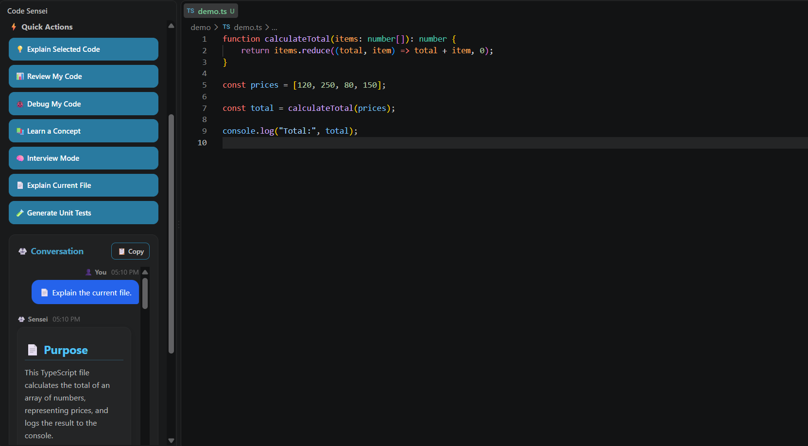
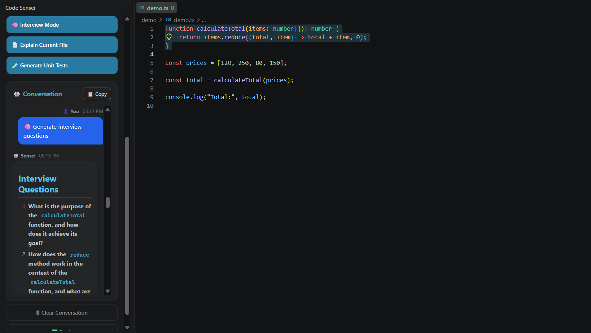

# 🥋 Code Sensei

<p align="center">
  <strong>Your AI Coding Mentor inside VS Code.</strong>
</p>

<p align="center">
  Learn the code. Understand the reasoning. Build it yourself.
</p>

<p align="center">
  
</p>

<p align="center">
  <a href="https://github.com/VaradNatekar/code-sensei/releases/tag/v1.0.0">
    
  </a>
  
  
  
</p>

---

## 🧠 Learn. Build. Master.

Most AI coding tools focus on giving you the answer.

**Code Sensei focuses on helping you understand why.**

Code Sensei is an AI-powered coding mentor built directly into VS Code. It helps developers explain, review, debug, test, and learn from their code without leaving the editor.

> **Don't just copy the code. Understand it.**

---

## ✨ Features

| Feature | What it does |
|---|---|
| 💡 **Explain Selected Code** | Understand selected code step-by-step |
| 📊 **Review My Code** | Get structured feedback on your code |
| 🐞 **Debug My Code** | Identify problems and understand how to fix them |
| 📚 **Learn a Concept** | Learn programming concepts through your code |
| 🧠 **Interview Mode** | Turn your code into interview practice |
| 📄 **Explain Current File** | Understand an entire source file |
| 🧪 **Generate Unit Tests** | Generate testing strategies and test cases |

---

## 🚀 Code Sensei in Action

### 💡 Explain Selected Code

Select code and ask Sensei to explain what it does and why it works.



### 🐞 Debug My Code

Get guidance when something isn't working.



### 🧪 Generate Unit Tests

Generate test strategies for your selected code.



### 📄 Explain Current File

Understand the purpose and structure of an entire file.



### 🧠 Interview Mode

Turn your code into an interview-style learning session.



---

## 🎯 The Philosophy

Code Sensei isn't designed to replace the developer.

It's designed to help the developer **become better**.

```text
Question
   ↓
Understand
   ↓
Think
   ↓
Learn
   ↓
Build